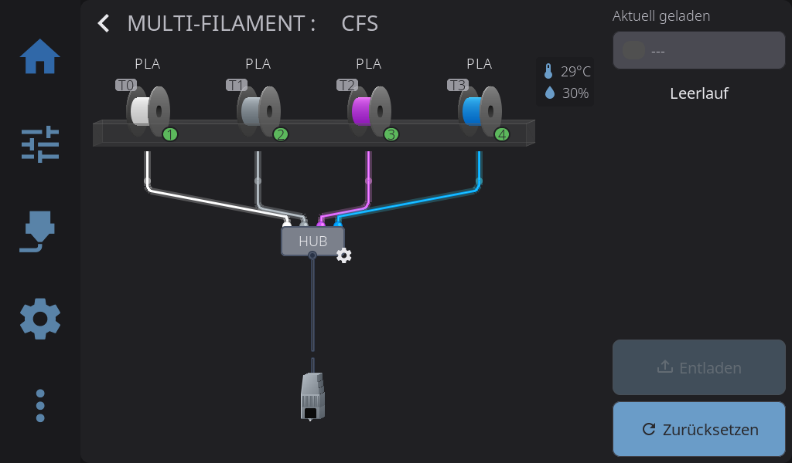
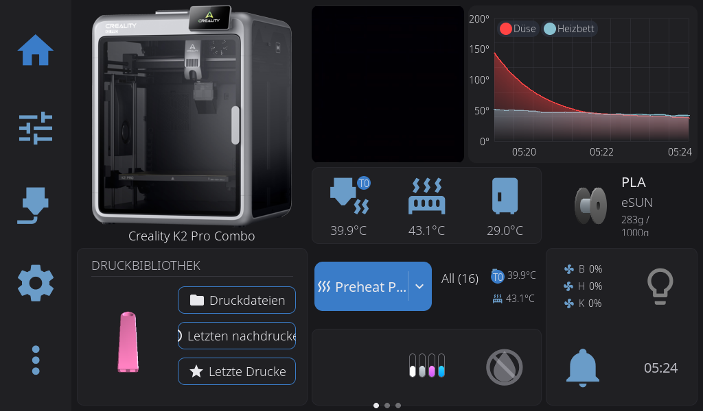

# HelixScreen-Pi-Entwicklungstest vom 2026-07-31 bis 2026-08-01

## Ziel

Auf dem separaten Raspberry Pi wird der aktuelle HelixScreen-`main`-Stand als
rueckrollbarer A/B-Test eingesetzt. Der Drucker selbst, seine Firmware,
Klipper, Moonraker, CFS und die MCUs werden dabei nicht ersetzt.

Ausgangspunkt war das stabile HelixScreen `0.99.105` mit Binary-SHA-256:

```text
4567d600735b03ccf1c52c042afd47308df72750aba079546f0474bd29a7e535
```

Das vollstaendige Rueckfallarchiv liegt auf dem Pi unter:

```text
/home/mks/backups/helixscreen_pre_main_c3d8be0_20260731_204250
SHA-256 0e994bd193a9e4f01dd38dfc0d6095e3c93640a1c96ea499f6c589ae4f5de9b6
```

## Warum dieser Entwicklungsstand

Der Livefehler war in HelixScreen-Upstream als
[Issue 1205](https://github.com/prestonbrown/helixscreen/issues/1205)
reproduziert: Ein gueltiger go2rtc-Snapshot des K2 Pro kann wegen des
H.264-Keyframes laenger als zwei Sekunden benoetigen. Stable `0.99.105` konnte
die Kamera deshalb faelschlich verwerfen und auf eine nicht vorhandene lokale
Pi-Kamera zurueckfallen.

Commit
[`b5d5873c0`](https://github.com/prestonbrown/helixscreen/commit/b5d5873c00d2e642781a3fb6341d9c96808a2de4)
trennt nun den Verbindungsaufbau von der Bildantwort: zwei Sekunden
Connect-Budget und sechs Sekunden Gesamtbudget. Der getestete `main`-Stand
enthaelt zusaetzlich Thumbnail-Race-/Use-after-free-Korrekturen,
Druckdateikarten-Fixes sowie mehrere 1024x600-, Micro- und Portrait-
Layoutkorrekturen.

## Reproduzierbarer Build

Upstream-Commit:

```text
c3d8be0978040d8b1948b9db5a29022c9c9cc659
```

Buildziel und Optionen:

```text
PLATFORM_TARGET=pi-both
CROSS_COMPILE=
ENABLE_MOCKS=no
ENABLE_REMOTE_CONTROL=yes
ENABLE_DEV_PANELS=no
```

`pi-both` liefert DRM und einen Framebuffer-Rueckfall. Es ist fuer den
separaten Pi geeigneter als HelixScreens internes K2-Geraeteziel, weil das
Kamera-Widget und die normale Pi-Displayunterstuetzung erhalten bleiben.

Der native Upstream-Dual-Link hatte bei eingeschalteter lokaler Teststeuerung
zwei reproduzierbare Buildluecken. Die normalen Pi-Linkflags mussten um die
vorhandenen DRM-/Input-Bibliotheken ergaenzt werden. Ausserdem fehlte dem
FBDEV-Sonderlink `REMOTE_LINENOISE_OBJ`. Die zweite Korrektur liegt als kleiner
Quellpatch unter
`helixscreen/patches/0001-pi-dual-link-include-remote-linenoise.patch`.
Sie betrifft nur den Build, nicht die Laufzeitsteuerung des Druckers.

## Sicherheitsgrenzen

- Die normale Helix-Oberflaeche besitzt die volle Druckerbedienung.
- Die zusaetzliche Teststeuerung lauscht ausschliesslich am lokalen Unix-Socket
  `/run/helixscreen/helixctl.sock` mit Benutzerrechten.
- Es gibt keinen Helix-Control-HTTP-Listener und keine neue LAN-Freigabe.
- Die automatisierte Verifikation verwendet nur `ping`, `status`, `current`,
  `wait_idle` und `screenshot`; sie sendet keine Bewegungs-, Heiz-, CFS- oder
  Druckbefehle.
- Die persistenten Einstellungen bleiben unter
  `/home/mks/printer_data/config/helixscreen` erhalten.

## Liveergebnis

Der atomare Austausch wurde am 2026-08-01 abgeschlossen. Der vorherige
Stable-Ordner blieb zusaetzlich zum Vollbackup auf dem Pi erhalten:

```text
/home/mks/helixscreen-stable-v0.99.105-before-main-c3d8be0-20260801_051305
```

Verifizierte installierte Binary-Hashes:

```text
DRM   d9a6ee4ffffc3ba8478f1000a8467d533294c88f1b6c5eb0fcf4e5090d352496
FBDEV e5c1b9b06c125adbafdd440a7ef0b404572fb5aa29cc354eea88825d30a2a528
```

Das reproduzierbare Pi-Releasearchiv hat SHA-256
`4e5663d310e403dd1e94e086e2c57314f31a47cecd9b81844edd4cbcde9c352f`.
Das kleine oeffentlich sichere Override-Archiv hat SHA-256
`b8be7fdc7bdfd77208477459535bda67ae0d9666f874ef6dea6bd37b21f63492`.

- `helixscreen.service` ist aktiv, `NRestarts=0`, keine fehlgeschlagenen Units.
- DRM nutzt `/dev/dri/card1` mit exakt `1024x600` im Querformat.
- Moonraker-/Klipper-Daten, Temperaturen und vier CFS-Slots werden dargestellt.
- Der direkte K2-Snapshot antwortete mit HTTP 200, benoetigte live aber rund
  4,75 Sekunden. Damit ist der neue 6-Sekunden-Probe-Fix fuer diesen Drucker
  praktisch relevant.
- Eine zweite, nur deaktivierte Kamera-Kachel wurde aus der Detailseite
  entfernt. Danach ist `camera_status_text` nach dem ersten Frame leer; der
  alte Dauertext `Kamera wird verbunden...` ist beseitigt.
- Drei Navigationszyklen zwischen Start- und Einstellungsseite ergaben keine
  Kamera-Thread-, Leak-, Crash- oder Neustartmeldung.
- Die Teststeuerung antwortet am lokalen Socket auf `ping`, `status`,
  `wait_idle` und `screenshot`. Es ist kein HTTP-Steuerport freigegeben.





Nach dem getesteten Commit bewegte sich Upstream-`main` bereits weiter. Diese
spaeteren, ungeprueften Entwicklungscommits wurden bewusst nicht hinter dem
laufenden Test her installiert; `c3d8be0` bleibt der reproduzierbare Pin.

## Rueckfall

Neben dem geprueften Archiv bleibt die vorherige Installationsstruktur beim
atomaren Austausch auf dem Pi erhalten. Bei Start-, Anzeige-, Kamera- oder
Moonraker-Problemen wird der neue Ordner gestoppt und die Stable-Struktur
zurueckbenannt; die persistenten Einstellungen werden dabei nicht geloescht.
