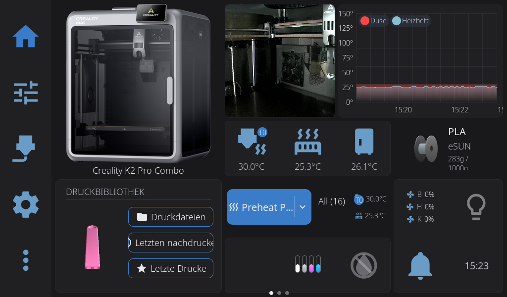

# HelixScreen-Pi-Update vom 2026-08-01

## Ergebnis

Auf dem separaten Raspberry Pi laeuft HelixScreen `0.99.106` vom exakten
Upstream-Commit `6f7f5bddb`. Der Build enthaelt die offizielle K2-Kamera-
Erkennung und nur zwei lokale Korrekturen fuer das native `pi-both`-Buildziel.
Es gibt keinen lokalen Laufzeitpatch an Drucker-, Moonraker-, Klipper-, CFS-
oder Kameralogik.

Verifizierte Binaerdateien:

```text
DRM   235d0291c73831e6d4b1814dde83346c5b227d4afbf8ac3be63f48a877c026bc
FBDEV c4c989d3b5ffea7e58556355138c57bb20b731546ded563c1a2b1b8fc22659fd
```

Das zweimal bytegleich erzeugte, normalisierte Pi-Archiv hat SHA-256:

```text
a399aac6fcbd50b7bdfc4518e267c58ea1b98da4625217f09bc1e58f6bac147f
```

## Build

```text
PLATFORM_TARGET=pi-both
CROSS_COMPILE=
NM_CMD=nm
OBJCOPY_CMD=objcopy
STRIP_CMD=strip
ENABLE_MOCKS=no
ENABLE_REMOTE_CONTROL=yes
ENABLE_DEV_PANELS=no
```

`pi-both` erzeugt eine DRM- und eine Framebuffer-Ausgabe. Die beiden kleinen
Buildkorrekturen liegen unter `helixscreen/patches/`:

- `0001-pi-dual-link-include-remote-linenoise.patch` nimmt das bereits
  kompilierte lokale Steuerobjekt in den FBDEV-Link auf.
- `0002-pi-dual-link-native-libraries.patch` stellt die DRM-/Input-
  Bibliotheken fuer den nativen DRM-Link bereit und filtert sie weiterhin aus
  dem FBDEV-Link heraus.

Beide Patches betreffen ausschliesslich den Linkvorgang. Die lokale
Diagnosesteuerung lauscht nur am Unix-Socket
`/run/helixscreen/helixctl.sock`; es wurde kein TCP-Steuerport geoeffnet.

## Livepruefung

- `helixscreen.service` ist aktiv, `NRestarts=0`.
- Das Display laeuft mit `1024x600` im Querformat.
- Moonraker-/Klipper-Werte, Temperaturen und alle vier CFS-Slots werden
  dargestellt.
- Das K2-Hauptbild wird mit `1280x720` angezeigt; bei vorhandenem Bild bleibt
  kein Text `Kamera wird verbunden...` stehen.
- Sichere Navigationstests zwischen Start- und Einstellungsseite verursachten
  keinen Crash, keinen Dienstneustart und keinen wachsenden RSS-Verbrauch.
- Die lokale Steuerung beantwortet `ping`, `status`, `wait_idle` und
  `screenshot`.



## Kamera-Restbeobachtung

Die Creality-Kamera liefert Einzelbilder erst mit dem naechsten H.264-
Schluesselbild. Gemessene Abrufe lagen meist zwischen etwa 2.9 und 4.9
Sekunden; ein Abruf benoetigte 5.9 Sekunden. Beim sehr schnellen Verlassen der
Startseite genau waehrend dieses Abrufs kann HelixScreens Sicherheitslogik
nach fuenf Sekunden einen noch laufenden Kamerathread abtrennen. Die Anzeige
erholte sich im Belastungstest selbststaendig innerhalb von rund 20 Sekunden;
Dienst, Speicherverbrauch und Kameraquelle blieben stabil.

Zwei A/B-Varianten wurden deshalb getestet und verworfen:

- Ein eigener 4-Sekunden-Snapshot-Timeout ist fuer reale K2-Schluesselbilder
  zu kurz. Der Testbuild wurde nie dauerhaft installiert; der automatische
  Rollback stellte die vorherigen Binaerhashes bytegleich wieder her.
- Ein lokaler H.264-nach-MJPEG-Transcoder funktionierte, belegte beim Test aber
  rund 69 Prozent eines Pi-CPU-Kerns. Er wurde nicht als Dienst eingerichtet.

Der stabile Stand bleibt damit Upstream `0.99.106` mit dem vorhandenen
Use-after-free-Schutz. Ein zusaetzlicher Laufzeitpatch waere erst sinnvoll,
wenn Upstream den blockierenden Snapshot-Abbruch selbst asynchron loest.

## Rueckfall

Vor dem Build und vor dem Binaeraustausch wurden getrennte Sicherungen erzeugt:

```text
/home/mks/backups/helixscreen_pre_v099106_20260801_123231
/home/mks/backups/helixscreen_official_v099106_before_remote_20260801_144338
```

Die zweite Sicherung enthaelt `restore-official-binaries.sh`. Sie stellt nur
die beiden Helix-Binaerdateien und den zugehoerigen Dienststand wieder her; die
persistenten Einstellungen unter
`/home/mks/printer_data/config/helixscreen` bleiben erhalten.
