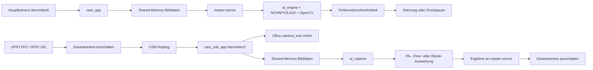

# Creality K2 Pro Combo: KI- und Kamerasystem

Stand: 31.07.2026  
Untersuchungsart: Live-Auswertung im Leerlauf, Auswertung vorhandener erfolgreicher
Druck- und Kalibrierungsprotokolle, Analyse lokaler Herstellerkomponenten sowie
Abgleich mit offizieller Creality-Dokumentation. Am Drucker wurden für diese
Studie keine Einstellungen oder Dateien verändert.

Prüfstand:

| Komponente | Ermittelter Stand |
|---|---|
| Druckermodell | F012, Board CR0CN200400C10 |
| Drucker-Firmware | 1.1.6.7 |
| CFS-Firmware | 1.5.0 |
| Helper bei der Analyse | v5.2.21.78-nozzle-ai-nonblocking |
| Daraus entwickelter Diagnosestand | v5.2.21.87-motor-status |

## Kurzfazit

Der K2 Pro besitzt zwei Kameras mit klar getrennten Aufgaben:

| Komponente | Aktuelle Kennung | Aufgabe | Normalzustand |
|---|---|---|---|
| Haupt-/Kammerkamera | CCX2F4013, Firmware 250708 | Livebild, Zeitraffer, Drucküberwachung und laufende Fehlererkennung | Im Leerlauf online |
| Düsen-/Subkamera | STD-8062V0, Firmware 0723V2 | Automatische Pressure-Advance- und Flow-Ratio-Auswertung sowie CFS-Abfallkontrolle | Im Leerlauf ausgeschaltet |

Die Bildauswertung läuft auf dem Drucker selbst. Dafür sind lokale
NCNN-/YOLOv5-Modelle und OpenCV-Komponenten installiert. Eine
Cloud-Verbindung ist für die eigentliche Inferenz nicht erforderlich. Davon
getrennte Telemetrie- oder Statusbilder können abhängig von Creality-Konto,
Datenschutzeinstellungen und Cloud-Funktionen übertragen werden.

Der aktuelle Zustand ist technisch plausibel und gesund:

- Hauptkamera online, 1280 x 720 bei 15 Bildern pro Sekunde.
- Düsenkamera im Leerlauf stromlos und deshalb nicht als USB-Gerät sichtbar.
- Düsenkamera wird bei Bedarf mit 1600 x 1200 bei 5 Bildern pro Sekunde
  zugeschaltet.
- Automatische Pressure-Advance- und Flow-Ratio-Kalibrierung sind aktiviert,
  laufen aber nur bei einem ausdrücklich mit Druckkalibrierung gestarteten Job.
- CFS-Abfallkontrolle ist aktiviert und verwendet die Düsenkamera nur
  kurzzeitig.
- Die laufende Druckfehlererkennung verwendet die Hauptkamera.

Die abschließende Live-Prüfung nach dem vollständigen Neustart bestätigte:
Klipper `ready`, `camera_main=online`, `camera_sub=offline`, GPIO 162 auf 1,
nur `/dev/video0` vorhanden und ausschließlich `cam_app` aktiv. Das ist
genau der erwartete Leerlaufzustand.

## 1. Systemaufbau



Die proprietäre Anwendung `master-server` koordiniert Druckstatus, Klipper,
Kamera, CFS und KI. Klipper stellt über das Modul `load_ai` die Brücke zu
dieser Anwendung bereit. Die eigentliche Kameraverwaltung verwendet OpenWrt
UBus und Shared Memory; sie ist kein normaler Moonraker-Webcam-Workflow.

## 2. Hauptkamera und laufende Drucküberwachung

Die Hauptkamera ist die reguläre Kammerkamera. Der Herstellerprozess
`cam_app` betreibt sie aktuell mit 1280 x 720 und 15 fps. Sie liefert:

- das Livebild für Creality Print, Display und Weboberflächen,
- Bilder für Zeitraffer,
- Bilder für die lokale Druckfehlererkennung,
- gesonderte Start-/End- oder Statusbilder für Herstellerfunktionen.

In einem erfolgreich protokollierten kurzen Testdruck startete
`PastaDetectV2` nach Erreichen der zweiten Schicht. Danach erfolgte ungefähr
alle 20 Sekunden eine Prüfung. Die einzelne lokale Inferenz dauerte etwa
4,5 bis 6 Sekunden. In zwölf Prüfungen wurde kein Fehler erkannt.

Diese beobachtete Taktung ist kein garantiertes festes Protokoll. Sie kann
von Firmware, Druckphase, Einstellung `pastaTime`, verfügbarer Rechenleistung
und dem internen V2-Ablauf abhängen.

Die laufende Hauptkamera-KI kann unter anderem typische Spaghetti- bzw.
Fehldruckmuster erkennen. Die Herstellerkomponenten enthalten außerdem
Modelle oder Modi für Fremdkörper, Warping, Materialansammlungen,
Abfallreste und fehlende Druckplatten. Der gemeinsame Binärcode unterstützt
mehrere Creality-Modelle; das Vorhandensein eines Modellnamens im Programm
beweist deshalb noch nicht, dass dieser Zweig beim K2 Pro tatsächlich aktiv
ist.

### Pauseverhalten

Aktuell ist `pausePrint=1` gesetzt. Eine ausreichend sichere
Fehlerklassifizierung darf den Druck somit pausieren. Die KI ist dennoch
keine Sicherheitsvorrichtung und kann sowohl Fehler übersehen als auch
Fehlalarme erzeugen. Beleuchtung, Bauteilfarbe, Reflexionen und verdeckte
Sicht beeinflussen das Ergebnis.

## 3. Warum die Düsenkamera meistens offline ist

Die Düsenkamera wird absichtlich nur bei Bedarf eingeschaltet. Ihr
Versorgungsweg ist aktiv-low:

| GPIO-Zustand | Bedeutung |
|---|---|
| GPIO 162 = 0 | Kamera eingeschaltet |
| GPIO 162 = 1 | Kamera ausgeschaltet |

Im normalen Leerlauf steht GPIO 162 auf 1. Dann existiert kein
`/dev/video2`, und UBus meldet `camera_sub` als offline. Das ist der
Sollzustand und schützt die Kamera vor unnötiger Laufzeit und Wärme.

Der SHA-256-Referenzwert des aktuell eingesetzten originalen
`nozzle_cam_power.sh` lautet
`35f8441be73a5c2741993832795bd0dee7dfba28277e8d2f795aa1d7abb274b9`.
Der installierte Helper schützt diesen nicht blockierenden Herstellerstand
vor einer erneuten Übernahme des früheren problematischen Kamera-Patches.

### Einschalt- und Kommunikationskette

1. `master-server` oder `load_ai` fordert eine Kalibrierungs- bzw.
   Waste-Aufnahme an.
2. Das originale Skript `nozzle_cam_power.sh` schaltet GPIO PF2/GPIO 162
   auf aktiv.
3. Die Kamera meldet sich am internen USB-Hub.
4. OpenWrt-Hotplug prüft, ob das Gerät MJPEG unterstützt, und erzeugt den
   Link `sub-video2`.
5. `auto_uvc.sh` startet `cam_sub_app`.
6. `cam_sub_app` setzt per UBus `camera_sub` auf online und stellt Frames
   über Shared Memory bereit.
7. `ai_capture 1` übernimmt die benötigten Bilder.
8. Die passende lokale Auswertung verarbeitet diese Bilder.
9. Nach dem Ergebnis wird die Kamera ausgeschaltet; USB-Gerät, Link und
   Prozess verschwinden wieder.

Die Schnittstelle läuft damit intern ungefähr so:

```text
Klipper/load_ai
  -> master-server
  -> GPIO
  -> USB-Hotplug
  -> cam_sub_app
  -> UBus + Shared Memory
  -> ai_capture
  -> ai_engine / detection / EMdetection
  -> master-server
  -> Klipper-Ergebnis oder CFS-Entscheidung
```

### Auffällige, aber normale Meldungen

- Ein Timeout beim allerersten Frame kann während des USB-Aufwärmens
  auftreten; danach kann die Aufnahme trotzdem erfolgreich sein.
- `xioctl error 19: No such device` direkt nach einer erfolgreichen
  Aufnahme und dem Ausschalten ist die Folge des beabsichtigten
  USB-Entfernens.
- `No camera type matched` trat bei einer erfolgreichen Waste-Prüfung auf.
  Das weist auf eine unvollständige Modellzuordnung im gemeinsamen
  Herstellerprogramm hin, nicht auf einen fehlgeschlagenen Test.

Diese Meldungen sind nur dann problematisch, wenn danach keine
Erfolgsaufnahme bzw. kein Ergebnis folgt oder die Kamera eingeschaltet
bleibt.

## 4. Automatische Pressure-Advance-Kalibrierung

`flowDetect` bezeichnet beim K2 Pro die automatische
Pressure-Advance-Kalibrierung, nicht die Einstellung der gesamten
Extrusionsmenge.

Der Ablauf:

1. Der Slicer startet einen Job mit aktivierter Druckkalibrierung.
2. Der Drucker führt Nivellierung und die proprietäre
   `CX_PRINT_LEVELING_CALIBRATION`-Kette aus.
3. Das Hersteller-G-Code-Muster
   `Auto_pressure_advance_multi.gcode` druckt mehrere Testbereiche.
4. Dabei werden unterschiedliche PA-Kandidaten und starke
   Geschwindigkeitswechsel verwendet.
5. Die Düsenkamera nimmt mehrere Bilder der Linien bzw. Ecken auf.
6. Die lokale Anwendung `detection` wertet Form, Überstand und Übergänge
   aus.
7. `master-server` erhält einen Wert `pressureAdvance`.
8. Klipper übernimmt ihn mit `SET_PRESSURE_ADVANCE`.

Beispielhaft enthält das Herstellermuster Kandidaten von etwa 0,020 bis
0,084, Geschwindigkeitswechsel von 20 bis 200 mm/s und eine Beschleunigung
von 12.000 mm/s². Diese Werte sind Teil des Kalibrierungsmusters und keine
Empfehlung, sie manuell als dauerhaftes Druckprofil einzutragen.

Wenn Bild oder berechneter Wert ungültig sind, verwendet die
Herstellerlogik einen Standardwert und kann einen AC0513-/AC0514-Hinweis
anzeigen.

## 5. Automatische Flow-Ratio-Kalibrierung

`flowEmDetect` bezeichnet die automatische Ermittlung des
Extrusionsmultiplikators bzw. Flow Ratio. Sie ist von Pressure Advance
getrennt.

Der Ablauf:

1. `Auto_Em.gcode` druckt ein zweischichtiges Kalibrierungsobjekt.
2. Die Düsenkamera fotografiert mehrere definierte Positionen.
3. `EMdetection` verarbeitet die Bilder mit OpenCV.
4. Materialname, Farbe, G-Code-Flow-Ratio und Schichtinformation fließen
   in die Auswertung ein.
5. Das Programm bestimmt `best_flow_percentage`.
6. `master-server` setzt den gewählten Wert über `M221 S...`.

Auch hier wird bei einem ungültigen Bild oder Ergebnis ein Standardwert
verwendet; dazu gehören die offiziellen Hinweise AC0515/AC0516.

Creality dokumentiert für die K2-Pro-Autokalibrierung mehrere unterstützte
Materialklassen. Die exakt installierte F012-Firmware 1.1.6.7 enthält im
Auto-Flow-Zweig jedoch ausdrücklich die Abbruchmeldung
`ai flow_em detect fail, current print material is not PLA`. Deshalb wird
die automatische Flow-Ratio-Ermittlung in diesem Helper konservativ nur
für PLA-Familien als geeignet eingestuft, bis ein anderer Materialtyp auf
diesem exakten Firmwarestand erfolgreich protokolliert wurde. Pressure
Advance ist davon getrennt und kann einen breiteren Materialpfad besitzen.

## 6. Wann Flow und Pressure Advance tatsächlich laufen

Die aktuellen globalen Schalter lauten:

| Einstellung | Wert | Bedeutung |
|---|---:|---|
| `flowDetect` | 1 | automatische PA-Funktion verfügbar |
| `flowEmDetect` | 1 | automatische Flow-Ratio-Funktion verfügbar |
| `flowDetectMode` | 0 | interner Modus; genaue Enum nicht öffentlich |

Ein Wert von 1 bedeutet nicht, dass vor jedem normalen Druck beide
Kalibrierungen ausgeführt werden. Die Auswertung startet nur, wenn beim
Druckauftrag die Druckkalibrierung gewählt wurde und Datei, Slicerpfad und
Material unterstützt werden. Creality empfiehlt dafür Creality Print 5
oder neuer beziehungsweise OrcaSlicer 2 oder neuer.

Die installierte Creality-Print-Geräteoberfläche wurde bis zur gesendeten
WebSocket-Nachricht verfolgt:

```text
normaler Start:       enableSelfTest = 0
„Druckkalibrierung“:  enableSelfTest = 1
```

Fluidd, Mainsail und die aktuell untersuchte K2Dash-Version starten normale
Jobs mit 0. Dadurch können alle globalen Schalter eingeschaltet sein, ohne
dass Auto PA oder Auto Flow ausgeführt werden. Die beiden vorhandenen
Mini-Whistle-Protokolle zeigen genau diesen Fall: `with self test = 0`,
anschließend nur CFS-Waste-Kamera, aber kein `start flow_pa detect` und kein
`start flow_em detect`.

Ein Wert in `flow_rate.json`, Klippers aktueller `pressure_advance`, ein
CFS-Datenbankfeld `pressure` oder ein vorhandenes `M221` ist deshalb noch
kein Kalibrierungsergebnis. Als Messung gelten erst die zusammenhängenden
Herstellermarker `flow_pa result`/`flow_pa best_flow_pressure_advance`
beziehungsweise `flow_em best_flow_percentage`. Meldet der PA-Zweig den
Fallback aus `printer.cfg`, wird dieser ausdrücklich nicht als Messwert
übernommen.

`flowDetectMode=0` sollte nicht manuell verändert werden. Der Binärcode
kennt einen Quick-Modus, aber die genaue Zuordnung von 0 und 1 ist nicht
öffentlich dokumentiert.

## 7. CFS-Abfallkontrolle mit der Düsenkamera

Bei bestimmten CFS-Lade-/Wechselvorgängen wird `CR_BOX_WASTE` aufgerufen.
Die Kontrolle läuft nicht bei jedem einzelnen Wechsel, sondern über einen
internen Zähler in festgelegten Abständen.

Ein erfolgreich protokollierter Ablauf:

| Zeitpunkt | Ereignis |
|---|---|
| 20:01:09 | Waste-Prüfung und Kameraeinschalten beginnen |
| 20:01:11 | Düsenkamera online |
| 20:01:12 | lokale Waste-Inferenz |
| 20:01:15 | kein Abfallrest erkannt |
| 20:01:16 | Düsenkamera wieder offline |

Die lokale Waste-Auswertung betrachtet erkannte Rechtecke und deren
Flächenanteil. Erst bei hinreichend großer belegter Bildfläche wird die
höchste Wahrscheinlichkeit gegen `wasteTruth=80` bewertet. Das reduziert
Reaktionen auf kleine Reflexionen oder einzelne Filamentreste.

### Nicht mit FO0528 verwechseln

FO0528, also eine erwartete Extrusion ohne gemessene Filamentbewegung, ist
keine Kameraprüfung. Das CFS vergleicht dabei die angeforderte
G-Code-Extrusion mit der Bewegung seines Hub-Odometer-Rads. Kamera-KI und
CFS-Bewegungssensorik ergänzen sich, sind aber technisch getrennt.

## 8. Erste Schicht, Fremdkörper und Druckplatte

Aktuell ist `firstFloor=0`; die gesonderte visuelle
Erstschichterkennung ist damit ausgeschaltet. Dies ist eine Einstellung,
kein Defekt.

Nach der offiziellen K2-Pro-Dokumentation übernimmt die rechte
Kammerkamera die Überwachung und KI-Erkennung, während die Düsenkamera
primär Flow Ratio und Pressure Advance ermittelt. Die Bildprüfung von
erster Schicht, Fremdkörpern oder Druckplatte gehört daher zum
Hauptkamera-/KI-Pfad.

Das Herstellerprogramm kombiniert außerdem eine KI-basierte
Druckplattenerkennung mit einer Dehnungsmessstreifen-Prüfung. Welche
Unterzweige auf F012 in jeder Drucksituation aktiv werden, ist nicht
vollständig öffentlich dokumentiert. Im Binärprogramm vorhandene
LiDAR- oder F008-Zweige dürfen nicht auf den K2 Pro übertragen werden.

## 9. Aktuelle KI-Einstellungen

| Einstellung | Wert | Einordnung |
|---|---:|---|
| `aiMode` | 1 | KI-Modus aktiv |
| `switch` | 1 | allgemeine Druck-KI aktiv |
| `wasteSwitch` | 1 | CFS-Waste-KI aktiv |
| `detection` | 1 | Erkennung aktiv |
| `pausePrint` | 1 | Pause bei bestätigtem Fehler erlaubt |
| `firstFloor` | 0 | gesonderte Erstschicht-KI aus |
| `pastaTime` | 25 | Hersteller-Zeitparameter |
| `pastaTruth` | 70 | gespeicherte Pasta-Schwelle |
| `wasteTruth` | 80 | Waste-Schwelle |
| `sundriesTruth` | 62,5 | Fremdkörperschwelle |
| `plateMissingTruth` | 40 | Schwelle für fehlende Platte |
| `dataCollect` | 0 | Datensammlung deaktiviert |
| `flowDetect` | 1 | Auto-PA verfügbar |
| `flowEmDetect` | 1 | Auto-Flow-Ratio verfügbar |

Bei der beobachteten V2-Pasta-Auswertung erschien intern eine Schwelle von
0,60, obwohl `pastaTruth=70` gespeichert ist. Das kann eine
mehrstufige/adaptive V2-Schwelle oder eine interne Umrechnung sein. Ohne
Herstellerquellcode ist es kein belastbarer Beweis für eine fehlerhafte
Konfiguration.

Die Parameter `optimalHeight` und `plateMissingOptimalHeight` hängen
offenbar mit Aufnahmegeometrie bzw. dem geeigneten Erkennungszeitpunkt
zusammen. Ihre genaue Definition ist nicht öffentlich und sie sollten
nicht versuchsweise geändert werden.

## 10. Lokale KI-Komponenten

Die untersuchten ARM-Programme und Bibliotheken zeigen:

- lokale NCNN-/YOLOv5-Inferenz,
- OpenCV-Bildverarbeitung,
- mehrere lokale Modellvarianten unter `/usr/lib/yolov5`,
- separate Anwendungen für laufende Fehlererkennung, PA-Auswertung und
  Flow-Ratio-Ermittlung,
- Shared Memory für den Bildtransport zwischen Kameraprozess und KI.

`ai_engine` kennt intern mehrere Erkennungsmodi, beispielsweise Pasta,
Fremdkörper, Warping, Blob/Materialansammlung, Waste und fehlende
Druckplatte. Einige Modi können Modell- oder Firmwarevarianten zugeordnet
sein.

Die Ergebnisse werden über `master-server` zurück in den
Klipper-/Creality-Ablauf geführt. Moonraker ist dabei nur eine
Status-/Steuerbrücke; es führt die Bild-KI nicht selbst aus.

## 11. Diagnosegrenzen und gefährliche Testbefehle

Das Klipper-Modul `load_ai` registriert unter anderem:

- `LOAD_AI_NOZZLE_CAM_POWER_ON`
- `LOAD_AI_NOZZLE_CAM_POWER_OFF`
- `LOAD_AI_SET_AI_CONTROL_PREFER`
- `LOAD_AI_DEAL`
- `LOAD_AI_DETECT_WASTE`
- `LOAD_AI_GET_STATUS`
- `LOAD_AI_T_CMD_TEST`

Diese Befehle sind keine gewöhnlichen Statusmakros:

- `LOAD_AI_T_CMD_TEST` kann heizen und Achsen bewegen.
- `LOAD_AI_DEAL` enthält einen offenbar alten Uploadpfad zu einer internen
  Adresse und gehört nicht zum aktuell erfolgreich beobachteten Ablauf.
- `LOAD_AI_GET_STATUS` liefert im Modul teilweise fest eingebaute
  Testdaten und ist deshalb kein verlässlicher Live-Status.
- Manuelles dauerhaftes Einschalten der Düsenkamera umgeht ihren
  vorgesehenen Lebenszyklus.

Sichere Diagnosen sollten stattdessen Kamera-UBus-Status, GPIO-Zustand,
Klipper-Objekte und zeitlich zusammenhängende Logs nur lesend prüfen.

## 12. Was unverändert bleiben sollte

1. Das originale, nicht blockierende `nozzle_cam_power.sh` beibehalten.
2. Die Düsenkamera im Leerlauf ausgeschaltet lassen.
3. Keine K2-Plus-`tool.cfg`, fremden GPIO-Patches oder direkten
   CFS-/RS485-Motorbefehle übernehmen.
4. `flowDetectMode`, KI-Schwellen und Höhenparameter nicht ohne
   reproduzierbaren Testdatensatz verändern.
5. Hersteller-Klipper, `master-server`, Kamera-Firmware und KI-Modelle
   nicht einzeln gegen fremde Versionen austauschen.
6. Kalibrierung nach Filamenttypwechsel, Transport oder Firmware-Update
   gezielt starten, nicht zwangsläufig vor jedem normalen Druck.
7. Kameralinsen sauber halten; Creality empfiehlt insbesondere bei
   ABS-Nutzung eine regelmäßige, ungefähr wöchentliche Kontrolle.

## 13. Offene technische Punkte

- Die genaue Enum-Bedeutung von `flowDetectMode` ist nicht veröffentlicht.
- Der vollständige F012-Ablauf für Erstschicht-/Platten-KI konnte ohne
  absichtlich gestarteten Kalibrierungsdruck nicht in allen Zweigen
  beobachtet werden.
- Die Beziehung zwischen `pastaTruth=70` und der internen V2-Schwelle 0,60
  ist proprietär.
- Der gemeinsame `master-server` enthält Code für mehrere Druckermodelle.
  Statische Zeichenketten allein sind kein Nachweis aktiver
  K2-Pro-Funktion.
- Die lokale Inferenz ist belegt; Umfang und Ziel separater
  Herstellertelemetrie hängen jedoch von Cloud- und
  Datenschutzeinstellungen ab.

## 14. Offizielle Quellen

- [K2 Pro: Kamera-Wartung und Aufgaben beider Kameras](https://wiki.creality.com/en/k2-flagship-series/k2-pro/camera-maintenance)
- [K2 Pro: Erste Schicht und Druckkalibrierung](https://wiki.creality.com/en/k2-flagship-series/k2-pro/first-layer-adhesion-compression)
- [K2 Pro: Mehrfarbdruck und Druckkalibrierung](https://wiki.creality.com/en/k2-flagship-series/k2-pro/multi-color-printing-guide)
- [Creality: Allgemeine Fehlercode-Dokumentation](https://wiki.creality.com/en/printers-general-documents)
- [AC0504: Automatische Flow-Kalibrierung fehlgeschlagen](https://wiki.creality.com/en/printers-general-documents/AC0504)
- [AC0511: Nicht unterstützte Datei bzw. Slicerpfad](https://wiki.creality.com/en/printers-general-documents/AC0511)
- [AC0512: Nicht unterstütztes Material](https://wiki.creality.com/en/printers-general-documents/AC0512)
- [AC0513: Ungültiges Pressure-Advance-Bild](https://wiki.creality.com/en/printers-general-documents/AC0513)
- [AC0515: Ungültiges Flow-Ratio-Bild](https://wiki.creality.com/en/printers-general-documents/AC0515)
- [FO0528: CFS-Odometer und fehlende Filamentbewegung](https://wiki.creality.com/en/printers-general-documents/FO0528)
- [Creality: Beschreibung lokaler Kamera-KI am K1 Max als verwandte Architektur](https://wiki.creality.com/en/k1-flagship-series/k1-max/quick-start-guide/ai-feature-description)
- [Offizielle K2-Pro-Firmwareseite](https://www.crealitycloud.com/downloads/firmware/flagship-series/k2-pro)

## Ergebnis

Die aktuelle K2-Pro-Architektur arbeitet nicht mit einer permanent laufenden
Düsenkamera. Hauptkamera und Düsenkamera sind bewusst getrennt. Der
beobachtete Ablauf aus kurzzeitigem Einschalten, USB-Anmeldung, lokaler
Bildauswertung und anschließendem vollständigem Abschalten ist korrekt.
Pressure Advance, Flow Ratio, laufende Druckfehlererkennung und
CFS-Odometerüberwachung sind vier unterschiedliche Funktionen und sollten
bei der Fehlersuche getrennt betrachtet werden.
